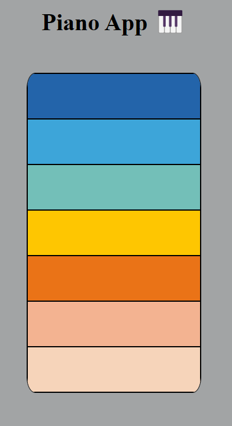

# Piano App

Base app to develop a piano

After clone, run

```bash
pnpm i
ng serve -o
```

## First piano



## Dependencies

[git linter](https://www.npmjs.com/package/git-commit-msg-linter):A lightweight, independent, 0 configurations and joyful git commit message linter.
👀 Watching your every git commit message INSTANTLY 🚀.
